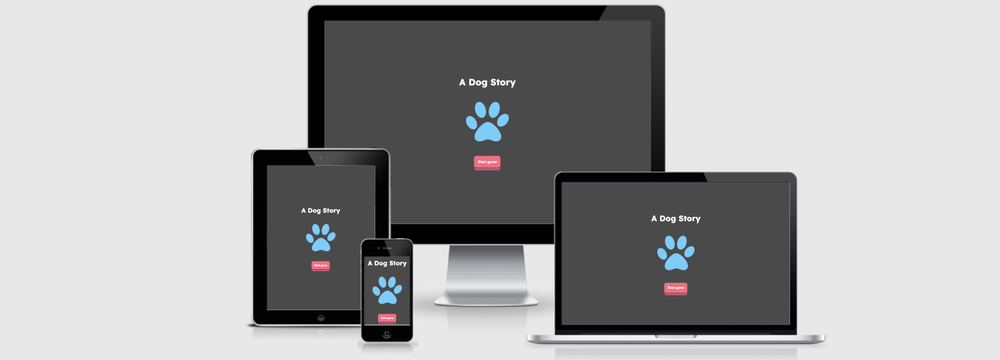
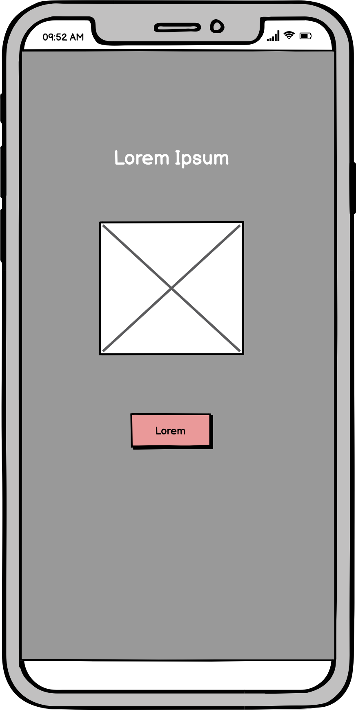
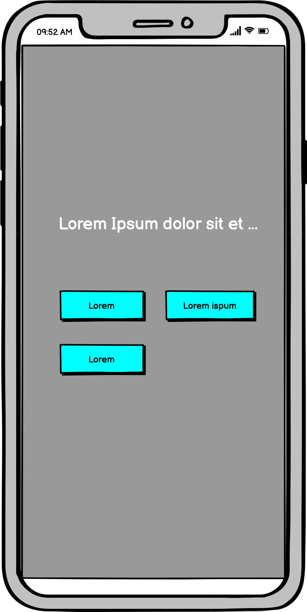
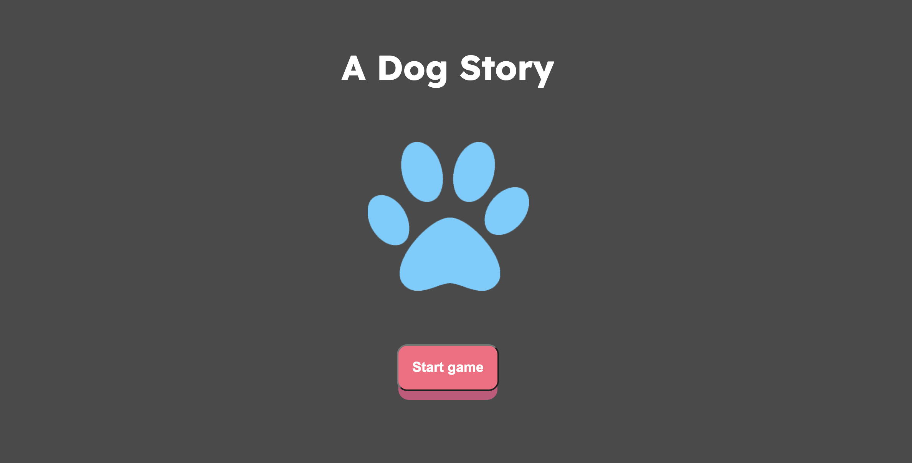
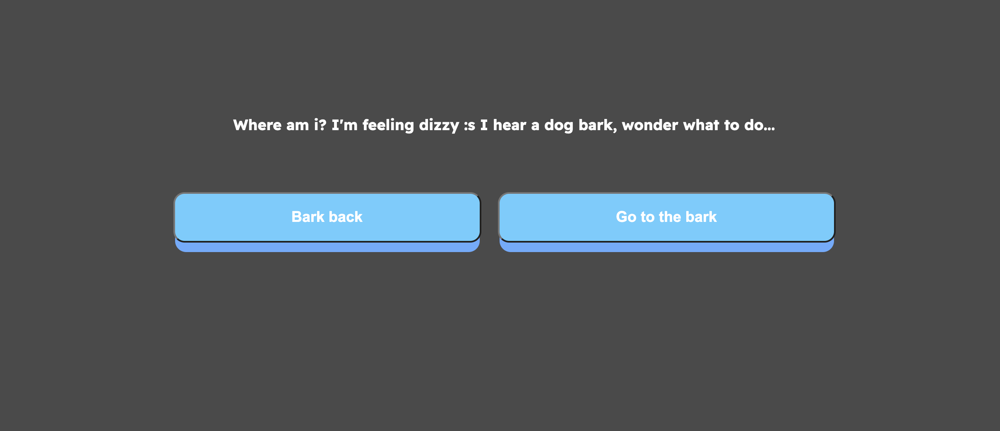
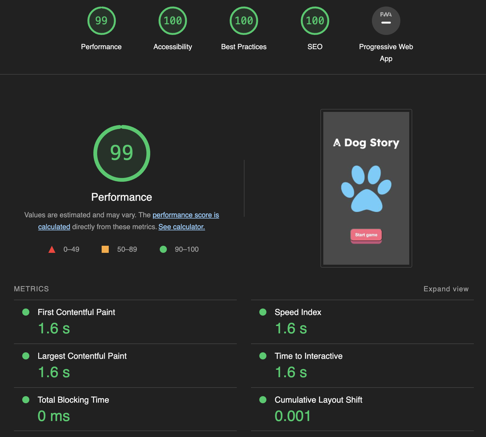

<h1 align="center">A Dog Story</h1>


[View the live project here.](https://joachimnorden.github.io/A-text-based-game/)


This is a text-based game made with simple Javascript, CSS and HTML. Users can select only one option. If you select wrong option you loose and have to restart the story.

If you choose the right option the game continues until you lose or win. Good luck :)


<h2 align="center"></h2>


## User Experience (UX)


-   ### User stories


    -   #### First Time Visitor Goals

        - I want it to be easy to start the game and begin my journey.


-   ### Design

    -   #### Colour Scheme

        -   The grey background is meant to set the mood and make the text pop a bit more since it's a text-based game. The main colors used is blue and pink. Pink is for the main CTA that stands out from the rest. The blue is for the game options and the icon.

    -   #### Typography

        -   The Readex Pro is the main font for this application with Sans Serif as the fallback font in case for any reason the font isn't being imported into the site correctly. I felt like the Readex Pro had some playfulness that fit the game well and it is always used with Bold to make it stand out from the background. 
        

    -   #### Imagery

        -   The imagery is there to create a uniqueness on the start screen. But I didn't want it to distract the text when playing the game so it's not used inside the game itself.


*   ### Wireframes


    -   Start screen Mobile Wireframe
    <h2 align="center"></h2>

    -   Game screen Mobile Wireframe
    <h2 align="center"></h2>


## Features


-   It's made with mobile usage in mind. But it works well on all devices.

### Startscreen

<h2 align="left"></h2>

-   There to create some uniqueness to the game and to easily start the game with a big CTA.

### Gamescreen

<h2 align="left"></h2>

-   As a text-based game I wanted to keep it simple. A white text on a dark background to really keep focus on the text itself and big clear button with a 3D-effect that wants to be clicked. 


## Features to be added

-   A longer and updated story is in the making

-   A clicktracker to compete with friends and family who is the fastest.

-   Make the inventory visible in the gamescreen


## Technologies Used


### Languages Used


-   [HTML5](https://en.wikipedia.org/wiki/HTML5)

-   [CSS3](https://en.wikipedia.org/wiki/Cascading_Style_Sheets)

-   [Javscript](https://www.javascript.com/)


### Frameworks, Libraries & Programs Used


1. [Google Fonts:](https://fonts.google.com/)

    - Google fonts were used to import the 'Readex Pro' font into the style.css file which is used on all pages throughout the project.


2. [Git](https://git-scm.com/)

    - Git was used for version control by utilizing the Gitpod terminal to commit to Git and Push to GitHub.

3. [GitHub:](https://github.com/)

    - GitHub is used to store the projects code after being pushed from Git.

4. [Photoshop:](https://www.adobe.com/ie/products/photoshop.html)

    - Photoshop was used to edit the logo.

6. [Balsamiq:](https://balsamiq.com/)

    - Balsamiq was used to create the wireframes during the design process.

7. [Pythontutor](https://pythontutor.com/)

    - Pythontutor helped me troughout and was a good tool to have when you got stuck.

## Testing


The W3C Markup Validator, W3C CSS Validator Services and JSHint were used to validate every page of the project to ensure there were no syntax errors in the project.


-   HTML

     - No errors were returned when passing through the official W3C validator

-   CSS

     - No errors were returned when passing through the official W3C validator

-   Javascript

    - No major errors were returned when passing through the JSHint validator.

- Accessibility

    - I confirmed thet the colors and fonts choses are easy to read and accessible by running it through lighthouse in devtools.

<h2 align="center"></h2>


### Testing


-   The Website was tested on Google Chrome, Internet Explorer, Microsoft Edge and Safari browsers.

-   The website was viewed on a variety of devices such as Desktop, Laptop, iPhone7, iPhone 8 & iPhoneX.

-   Friends and family members were asked to review the site and documentation to point out any bugs and/or user experience issues.


### Known Bugs


-   The game doesn't work on Internet Explorer

## Deployment


### GitHub Pages


The project was deployed to GitHub Pages using the following steps...


1. Log in to GitHub and locate the [GitHub Repository](https://github.com/joachimnorden/A-text-based-game)

2. At the top of the Repository (not top of page), locate the "Settings" Button on the menu.

3. Scroll down the Settings page until you locate the "GitHub Pages" Section.

4. Under "Source", click the dropdown called "None" and select "Master Branch".

5. The page will automatically refresh.

6. Scroll back down through the page to locate the now published site in the "GitHub Pages" section.


### Forking the GitHub Repository


By forking the GitHub Repository we make a copy of the original repository on our GitHub account to view and/or make changes without affecting the original repository by using the following steps...


1. Log in to GitHub and locate the [GitHub Repository](https://github.com/joachimnorden/A-text-based-game)

2. At the top of the Repository (not top of page) just above the "Settings" Button on the menu, locate the "Fork" Button.

3. You should now have a copy of the original repository in your GitHub account.


### Making a Local Clone


1. Log in to GitHub and locate the [GitHub Repository](https://github.com/joachimnorden/A-text-based-game)

2. Under the repository name, click "Clone or download".

3. To clone the repository using HTTPS, under "Clone with HTTPS", copy the link.

4. Open Git Bash

5. Change the current working directory to the location where you want the cloned directory to be made.

6. Type `git clone`, and then paste the URL you copied in Step 3.


```

$ git clone https://github.com/YOUR-USERNAME/YOUR-REPOSITORY

```


7. Press Enter. Your local clone will be created.


```

$ git clone https://github.com/YOUR-USERNAME/YOUR-REPOSITORY

> Cloning into `CI-Clone`...

> remote: Counting objects: 10, done.

> remote: Compressing objects: 100% (8/8), done.

> remove: Total 10 (delta 1), reused 10 (delta 1)

> Unpacking objects: 100% (10/10), done.

```


Click [Here](https://help.github.com/en/github/creating-cloning-and-archiving-repositories/cloning-a-repository#cloning-a-repository-to-github-desktop) to retrieve pictures for some of the buttons and more detailed explanations of the above process.


## Credits


### Code


-   The game "engine" was inspired by this [codepen](https://codepen.io/rzim2082/pen/jrWYJW)

-   The buttons was inspired by this [codepen](https://codepen.io/kathykato/pen/gOOjgmPa)

-   This post helped me with some flexbox issues I had [Stackoverflow](https://stackoverflow.com/questions/35578404/giving-wrapped-flexbox-items-vertical-spacing/35578723)


### Content


-   I wanna thank my physical post-it notes to help me keep track of the story.


### Media


-   The icon used were taken from [here](https://pixabay.com/vectors/paw-print-dog-cat-animal-pet-5892565/).


### Acknowledgements


-   My Partner for helping me with the story.


-   Tutor support at Code Institute for their support.